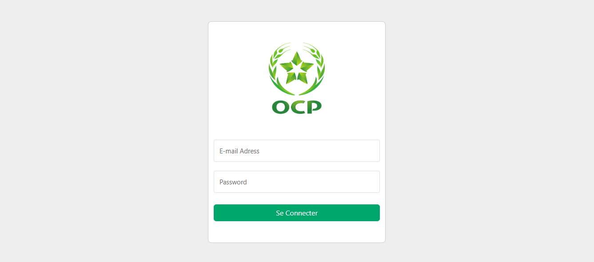
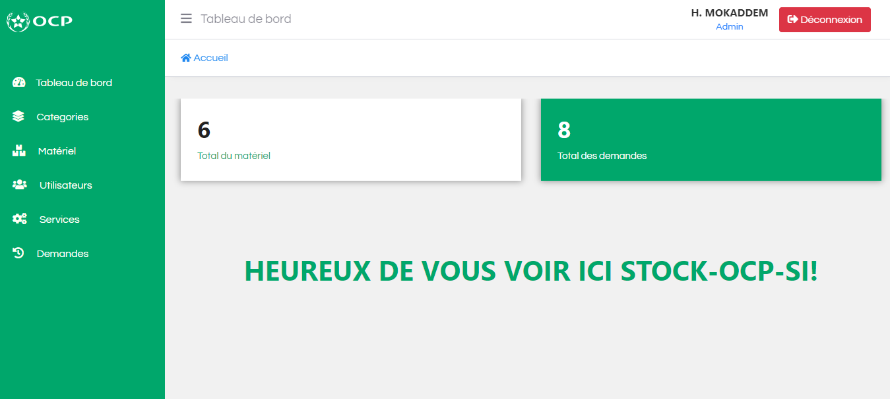
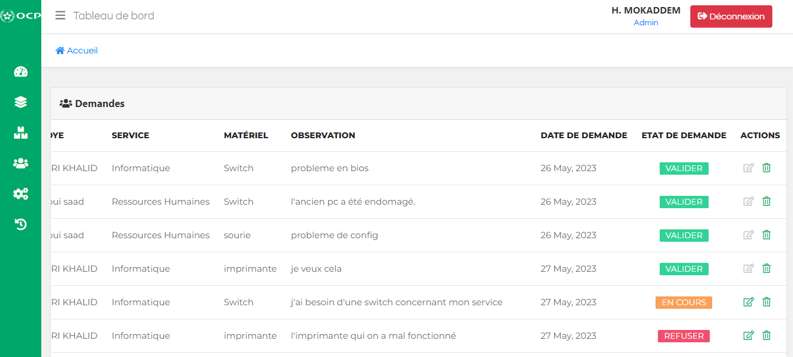

# Gestion de Stock OCP V 2.1

L'application "Gestion de Stock OCP" est développée en utilisant PHP natif. Elle vise à mettre en place une solution efficace pour la gestion des stocks de matériels informatiques, en offrant aux employés la possibilité de soumettre des demandes via une application web dédiée.

## Objectifs

Les objectifs spécifiques de l'application comprennent :

- **Amélioration de la Gestion des Stocks :** Enregistrement et suivi en temps réel des matériels disponibles dans le stock, en incluant les quantités, les références et les informations associées.

- **Facilitation des Demandes de Matériel :** Permet aux employés de soumettre des demandes de matériel spécifique en précisant la quantité requise et d'autres détails pertinents.

- **Suivi des Demandes :** Possibilité de suivre les demandes en cours, y compris leur statut.

- **Communication Améliorée :** Facilite la communication entre les employés et le service responsable des stocks.

- **Réduction des Erreurs et des Retards :** Diminue les erreurs et les retards associés à la gestion manuelle des stocks.

- **Tableaux de Bord :** Fournit des tableaux de bord pour une vue d'ensemble des stocks et le total des demandes.

## Installation

Pour utiliser l'application, suivez les étapes d'installation ci-dessous :

1. Clonez ce dépôt sur votre machine.
   ```bash
   git clone https://github.com/mokaddemhicham/Gestion-de-Stock-OCP.git
2. Accédez au répertoire du projet : `cd quiz-app`
3. Assurez-vous que XAMPP est lancé : <br>
   Avant de continuer, assurez-vous que le serveur web Apache et le serveur de base de données MySQL de XAMPP sont en cours d'exécution.
4. Configurer l'Environnement PHP et la Base de Données :

   a. Ouvrez le fichier `database/database.php`.

   b. Recherchez la section suivante et mettez à jour les espaces réservés avec vos informations d'identification de la base de données :

   ```php
   private static $dbhost = "localhost";
   private static $dbname = "gestion_de_stock_v2";
   private static $dbusername = "root";
   private static $dbpassword = "";
   ```
   c. Enregistrez les modifications.

5. Importer la Base de Données : <br>
   Utilisez le fichier SQL fourni pour importer la structure de la base de données et les données nécessaires.

6. Lancer l'Application : <br>
   Accédez à l'URL correspondante dans votre navigateur pour lancer l'application et commencer à gérer vos stocks.
   ```bash
   http://localhost/Gestion-de-Stock-OCP
## Captures d'écran


*Capture d'écran de la page de connexion : Interface où les utilisateurs peuvent se connecter à l'application en saisissant leurs informations d'identification.*



*Capture d'écran de la page d'accueil de l'administrateur : Interface affichant un tableau de bord personnalisé avec des informations clés sur les stocks, les demandes en cours et d'autres données pertinentes pour l'administrateur.*



*Capture d'écran de la page d'administration : Vue des demandes de matériel soumises par les employés, affichant les détails des demandes, leur statut actuel et les options pour y répondre ou les gérer.*

## Auteurs

- [Hicham Mokaddem](https://github.com/mokaddemhicham)

## Contributions

Nous accueillons les contributions à ce projet. Si vous souhaitez contribuer, veuillez suivre ces étapes :

1. Fork ce projet.
2. Créez une branche pour votre contribution (`git checkout -b contribution-nom`).
3. Faites vos modifications et ajoutez des commentaires appropriés.
4. Testez soigneusement vos modifications.
5. Soumettez une demande d'extraction (Pull Request).
6. Attendez la revue et l'approbation de votre demande.

Nous apprécions grandement toute contribution et reconnaissons nos contributeurs dans cette section.
